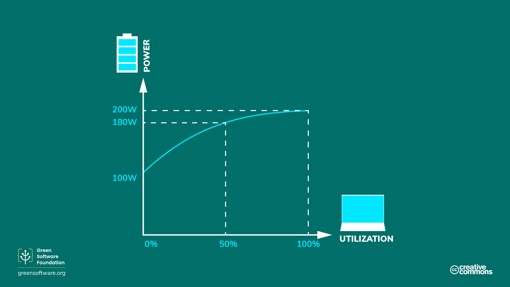

template: titleslide
# Energy Efficiency

---
# How HPC is powered

Research codes running on HPC systems consume electricity, which is a form of energy that has been
converted from a primary power source such as fossil fuels, nuclear fission or renewables.

- Coal, gas and oil are examples of fossil fuels.
  - The conversion of chemical energy to electricity via combustion emits carbon.

- Nuclear power does not emit carbon when converted to electricity and so in that respect is carbon neutral.
 

---
# How HPC is powered

Research codes running on HPC systems consume electricity, which is a form of energy that has been
converted from a primary power source such as fossil fuels, nuclear fission or renewables.

- Coal, gas and oil are examples of fossil fuels.
  - The conversion of chemical energy to electricity via combustion emits carbon.

- Nuclear power does not emit carbon when converted to electricity and so in that respect is carbon neutral.
 
- Renewables are also carbon neutral and are so abundant they can be considered  to be limitless.
  - Examples are wind, solar, tidal, geothemal and hydroelectric,  so called "green" energy.

- Carbon neutral sources of energy then are thought of as generating "clean" electricity.
  - And so fossil fuels generate "dirty" electricity.

---
# Are renewables and nuclear really carbon neutral?
  
- Complex infrastructure is required to harness carbon neutral sources of power,
  - e.g. nuclear power stations, solar panels, wind turbines.

- Embodied sources of carbon emissions are those emissions resulting from construction and manufacture of equipment.
  - This applies to HPC hardware as well.

- There are carbon emissions associated with decommissioning of hardware too.
  - For nuclear power, there is also the processing and storage of spent nuclear fuel.

---
# Are renewables and nuclear really carbon neutral?
  
- Complex infrastructure is required to harness carbon neutral sources of power,
  - e.g. nuclear power stations, solar panels, wind turbines.

- Embodied sources of carbon emissions are those emissions resulting from construction and manufacture of equipment.
  - This applies to HPC hardware as well.

- There are carbon emissions associated with decommissioning of hardware too.
  - For nuclear power, there is also the processing and storage of spent nuclear fuel.

- The embodied emissions due to renewables are insignificant however compared to the *emissions saved* over the lifetime of the facility powered by renewable sources.
  - That is those emissions that would have been produced by a non-renewable powered facility over the same time period.  

---
# How to make HPC energy efficient

The electricity consumed when a code runs on a HPC system depends on the following,

- the design and algorithm choices of the software engineers who wrote the software;
- how the source code is interpreted by compilers to produce machine-executable code; 
- the input and configuration parameters that specify how the code runs;
- the technology of the HPC system itself.
  
In general, the shorter the time required to run a code on a HPC system,
- the less electricity is needed;
- the less energy is used;
- the less carbon is emitted.

The above is true if the electricity used by the HPC system was generated from
fossil fuels (coal, gas or oil).

---
# HPC and carbon efficiency

- If a HPC system is located in regions were electricity is generated by burning fossil fuels, electricity use is proportional to carbon emissions.
  - The *running* of a HPC system must be energy efficient in order to be carbon efficient.

- In the UK, just 11.5% of carbon emissions are due to energy generation as measured in 2023 ([Department for Energy Security & Net Zero](https://assets.publishing.service.gov.uk/media/6604460f91a320001a82b0fd/uk-greenhouse-gas-emissions-provisional-figures-statistical-release-2023.pdf)).

- UK GHG emissions decreased by 52.7% over the period 1990 to 2023.
  - Reduction mostly due to lower energy consumption following decline in energy intensive industries.

- It is still worthwhile to minimise energy consumption even if electricity is being generated from carbon neutral sources.
  - However, embodied sources of carbon are now more important when it comes to improving carbon efficiency.

---
# A quick primer on energy measurement

- Energy is measured in joules (J), the SI unit of energy.

- Power is measured in watts, where 1 watt (W) is a rate corresponding to  one joule per second.

- A kilowatt (kW) therefore corresponds to 1000 joules per second.

- A kilowatt-hour (kWh) is an alternative measure of energy corresponding to  one kilowatt of power sustained for one hour.

---
# Power Usage Effectiveness

- The Power Usage Effectiveness (PUE) metric was developed by [Green Grid](https://datacenters.lbl.gov/sites/default/files/WP49-PUE%20A%20Comprehensive%20Examination%20of%20the%20Metric_v6.pdf) to measure the energy efficiency of data centres.

- Basically, the PUE captures the overheads associated with running a data centre.
  - For example, a PUE of 2.0 means an additional watt of power is required for every watt of power used for HPC. This additional watt is needed for such overheads as cooling and power distribution.

.center[]

---
# Power Usage Effectiveness

- The PUE can also be thought of as a multiplier to your energy consumption  when using HPC.

.center[]

- If your HPC machine used 10 kWh when running a simulation and the PUE is 1.5,  the *actual* energy consumption from the grid is 15 kWh, meaning 5 kWh is required  for operational overheads.

---
# PUE is not constant

- The PUE varies according to how much energy is needed to the cool the HPC system.

- More cooling is required if...
  - more compute nodes of the HPC system are in use, or,
  - the outside air temperature is warmer.

- Sometimes the outside temperature is cold enough to cool the HPC system without mechnical cooling.

- Averaged over the calendar year, the PUE of the Advanced Data Facility (ADF) that hosts ARCHER2 is 1.1.
  - As the ADF is located in Scotland, where temperatures are cooler compared to London, ARCHER2 benefits from free cooling for most of the year.

---
# Energy proportionality

- Energy proportionality is the relationship between power consumed by a HPC system and its utilisation.

  - This relationship is not linear and power is consumed even if the system is not being used at all.

.center[]

- The more we utilise a HPC system the more efficient it becomes at using electricity to support HPC users.

  - But, how much of that utilisation is doing useful work?

---
# HPC application performance 

- Energy proportionality holds if the HPC application is **compute-bound**.
  - Its performance is limited by processor speed, or, more usually, the performance of the *floating point units* within the processor.

- Performance can also be **memory-bound** in that it can be limited by the time it takes to access data in memory.
  - Extra power draw does not increase the number of instructions done per unit of time, instead, the additional power is required for memory operations.

---
# HPC application performance 

- Energy proportionality holds if the HPC application is **compute-bound**.
  - Its performance is limited by processor speed, or, more usually, the performance of the *floating point units* within the processor.

- Performance can also be **memory-bound** in that it can be limited by the time it takes to access data in memory.
  - Extra power draw does not increase the number of instructions done per unit of time, instead, the additional power is required for memory operations.

- Applications can also be **communications-bound** if running in parallel or **IO-bound**.
  - Different contraints will apply at different points during the application's runtime.

- HPC applications are, if at all, compute-bound only for short periods of their runtime.
  - Hence, energy proportionality breaks down if trying to relate power consumed to *useful* work.

---
# Static power draw

- The static power draw of a HPC system is the amount of power drawn when the system is in an idle state (0% utilisation).

- Personal computers have a hibernation mode that is entered automatically should the computer not be used for a period of time
configurable by the user.
  - The cost of this energy saving is that additional time is needed to "wake up" from hibernation.

- HPC systems need to be "always on" since demand is unpredictable, maximising idle power consumption.
  - For this reason, HPC sites aim to run as close as possible to 100% utilisation.

---
# Exercise: Energy efficiency on HPC systems

The [GROMACS application](https://docs.archer2.ac.uk/research-software/gromacs/) running on ARCHER2 for a simulation time of 0.02 ns 
has the following performance for a range node of counts and CPU frequency settings.

|  Nodes |||| 2.0 GHz Runtime [s], kWh |||| 2.25 GHz + boost Runtime [s], kWh |
| ---:      |||| ---:                        |||| ---:                                 |
| 1         |||| 369, 0.0464                 |||| 288, 0.0464                          |
| 2         |||| 198, 0.0450                 |||| 156, 0.0465                          |
| 3         |||| 155, 0.0438                 |||| 109, 0.0465                          |
| 4         |||| 117, 0.0471                 ||||  93, 0.0513                          |

What are the most energy efficient combinations of node count and CPU frequency  in terms of kWh/ns?

Which combination has the worst performance and what is the percentage difference between this and
the best-performing combination?

---
# Solution: Energy efficiency on HPC systems

We can compute the energy efficiency in kWh/ns by dividing the energy use by the simulation time in nanoseconds,
which is 0.02 ns.

|  Nodes |||| 2.0 GHz Runtime [s], kWh/ns |||| 2.25 GHz + boost Runtime [s], kWh/ns |
| ---:      |||| ---:                        |||| ---:                                 |
| 1         |||| 369, 2.32                 |||| 288, 2.32                          |
| 2         |||| 198, 2.25                 |||| 156, 2.32                          |
| 3         |||| 155, 2.19                 |||| 109, 2.32                          |
| 4         |||| 117, 2.36                 ||||  93, 2.56                          |

So, the most energy efficient combination is 3 nodes at 2 GHz CPU clock frequency and the worst is 4 nodes with 2.25 GHz + boost CPU clock frequency.
And the worst case is around 17% less energy efficient than the best case.

While this difference may not amount to much energy for a single run, it can lead to a significant reduction in consumed energy if many simulations
are to be run as part of a project.

---
          
# Morning Break

---
# Next Lecture

 
## [Carbon Awareness](../4-carbon-awareness)