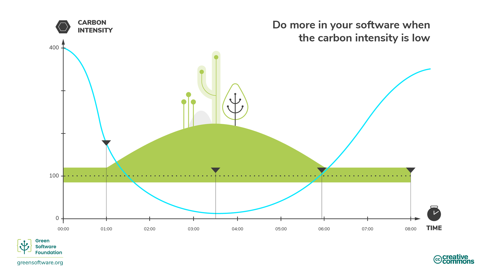

template: titleslide
# Carbon Awareness

---
# Carbon awareness

- Electricity is generated from various sources.
  - Some sources emit no (or little) carbon, e.g., renewables.
  - Other sources emit substantial quantities of carbon, e.g., fossil fuels.
    - The ratio of carbon emitted for coal:oil:gas is approximately [100:72:56](https://www.forestresearch.gov.uk/tools-and-resources/fthr/biomass-energy-resources/reference-biomass/facts-figures/carbon-emissions-of-different-fuels/).

- The energy mix are the proportions of electricity contributed by each energy source.
  - The actual proportions vary by place and by time.

- Carbon awareness is about doing more work when electricity is being generated from  low carbon sources and less when it is not.

---
# Carbon intensity

- Carbon intensity (CI) measures how much carbon is emitted per kilowatt-hour (kWh) of electricity consumed.
  - Units are gCO2e / kWh , grams of carbon dioxide equivalent per kilowatt-hour.

- If your computer is directly plugged into a wind farm, the electricity required to run the computer would have zero carbon intensity.

- In actual fact, a computer (or HPC system) is plugged into a national grid that is supplied with electricity from various sources.
  - How much electricity is provided by each source is outside of the customer's control.

---
# Carbon intensity varies by  UK region

 

| Type        |||| Carbon Intensity |||| UK Region |
| ---:        |||| ---:             |||| :--- |
| Low         |||| 22-48            |||| Scotland, N. England |
| Low Medium  |||| 77               |||| N. Wales |
| Medium      |||| 108-135          |||| Yorkshire, London, W. Midlands, E. & SE. England |
| High Medium |||| 186-203          |||| E. Midlands, S. England |
| High        |||| 242-255          |||| S. Wales, SE. England |

Carbon intensities in units of gCO2e / kWh over the year 2024.

- Some UK regions have an energy mix that has a majority contribution from "clean" energy sources, see [electricityinfo.org regional carbon intensity history](https://electricityinfo.org/region-archive/).

---
# Carbon intensity varies by country

| Carbon Intensity |||| Country (Pop. M) |||| % Change |
| ---: |||| ---: |||| ---: |
| 959  |||| Kosovo (1.6) |||| -3
| 636  |||| Taiwan (23) |||| 0
| 560  |||| China (1416) |||| -29
| 552  |||| Australia (27) |||| -32
| 470  |||| Russia (144) |||| -4
| 384  |||| USA (347) |||| -37
| 344  |||| Germany (84) |||| -40
| 211  |||| UK (70) |||| -60
| 31   |||| Norway (5.6) |||| +19

*Per capita* carbon intensities in units of gCO2e / kWh over the year 2024 and the percentage change between 2000 and 2024.

- Worldwide per capita carbon intensity has fallen by 10% over the last 24 years,   See [Our World in Data](https://ourworldindata.org/grapher/carbon-intensity-electricity?tab=table) for further info.

---
# Exercise: Carbon emissions from HPC systems

One estimate of the power draw of the ARCHER2 HPC system is 3.1 MW  (this includes overheads due to power and cooling).

The mean carbon intensity (CI) varies across the UK regions.  In 2024, three CI regions were identified.

|   Type |||| Carbon Intensity [gCO2e/kWh] |
| ---:   |||| ---:                                    |
|    low ||||  30                                     |
| medium |||| 120                                     |
|   high |||| 250                                     |

What would the carbon emissions be from the electricity use required for 1 year of ARCHER2 operations in the three different emission regions?

---
# Solution: Carbon emissions from HPC systems

First we need to estimate the amount of energy consumed by ARCHER2 in kWh for 1 year from the power draw estimate.

3,100 kW × 365 days × 24 hours = 27,156,000 kWh

Next, we multiply this energy use by the quoted carbon intensity values to get the estimated emissions from a year of ARCHER2
operation in the three different regions.

|   Type |||| Carbon Emissions [kgCO2e] |
| ---:   |||| ---:                                 |
|    low ||||   815,000                            |
| medium |||| 3,260,720                            |
|   high |||| 6,790,000                            |

Hosting ARCHER2 in a high CI region instead of the low CI region would lead to an additional 5,980,000 kgCO2e of emissions per year,
a more than eightfold increase.

---
# Carbon intensity varies over time

- Carbon intensity increases when the wind is not blowing or when it is cloudy.

.center[]

---
# Brownouts and blackouts

- The electricity grid must be run such that the demand and the supply are in balance.
  - This is the responsibiity of the grid operator.

- A brownout occurs when the demand exceeds supply.

- A blackout occurs when the supply exceeds demand.
  - Circuit breakers must be activated to avoid damaging infrastructure.

---
# Dispatchability and curtailment

- For fossil fuels and nuclear power, the amount of electricity produced can be controlled.
  - These sources of power have high dispatchability.

- Some renewable sources of energy, such as solar and wind, have low dispatchability.
  - And so, if the energy provided by those power sources exceeds demand, the electricity must be "thrown away",
  aka, curtailment.

---
# Marginal carbon intensity

- The marginal power plant usually runs on a power source that has high dispatchability.
  - In other words, it can meet a sudden increase in demand.

- Marginal carbon intensity is simply the carbon intensity of a marginal power plant.

- This is high for fossil-fueled power plants, which typically have a minimum functioning threshold.
  - Such plants provide an always-on baseload to the grid.

---
# Zero marginal carbon intensity

There is a scenario when the marginal carbon intensity is zero.

.center[]

This can happen if renewable sources are available to meet demand fluctuations via curtailment.

---
# Energy markets

- Energy prices fluctuate with demand; in general, the market can respond as follows.

- When demand **drops** buy less energy from...
  1. fossil fuel plants
  2. renewable sources

- When demand **rises** buy more energy from...
  1. renewable sources that are currently being curtailed
  2. fossil fuel plants

---
# Energy markets

- Energy prices fluctuate with demand; in general, the market can respond as follows.

- When demand **drops** buy less energy from...
  1. fossil fuel plants
  2. renewable sources

- When demand **rises** buy more energy from...
  1. renewable sources that are currently being curtailed
  2. fossil fuel plants

- The above picture is a simplification, in reality, it is much more complex.

- Market regulations are set so as to make fossil fuels expensive compared to renewables.
  - The hope is that investment will shift from fossil fuels to renewables.

---
# How to be more carbon aware

Use more electricity when it can be generated by carbon neutral sources of power.

.center[]

---
# Demand shifting

- HPC applications are schedulable and reasonably portable (using [containers](https://www.archer2.ac.uk/training/courses/250217-containers/)).

- The carbon intensity of electricity is lowest at various times and locations.

- Schedule work when carbon intensity is low.
    - This assumes conditions (e.g. weather, electicity demand) are predictable.

---
# Demand shifting

- HPC applications are schedulable and reasonably portable (using [containers](https://www.archer2.ac.uk/training/courses/250217-containers/)).

- The carbon intensity of electricity is lowest at various times and locations.

- Schedule work when carbon intensity is low.
    - This assumes conditions (e.g. weather, electicity demand) are predictable.

 
- Services exist that can provide carbon intensity predictions, see [carbonintensity.org.uk](https://carbonintensity.org.uk/).
  - Major IT companies such as [Google](https://blog.google/outreach-initiatives/sustainability/carbon-aware-computing-location/) and [Microsoft](https://www.techradar.com/news/windows-11-is-getting-an-eco-friendly-update-but-could-microsoft-do-more) are researching how to implement demand shifting.

---
# Spatial shifting

- Spatial shifting means moving your computation to a location where the current carbon intensity is low.
  - This might be a HPC facility that is close to a source of low carbon electricity that has been forecasted for a period of time, e.g. wind, solar.
  - Or the source could be more constant, e.g. geothermal, tidal.

.center[]

---
# Spatial shifting

- Spatial shifting means moving your computation to a *location* where the current carbon intensity is low.
  - This might be a HPC facility that is close to a source of low carbon electricity that has been forecasted for a period of time, e.g. wind, solar.
  - Or the source could be more constant, e.g. geothermal, tidal.

- This requires the computation to be portable.
   - Is your application compatible with the operating system and communication libraries installed on the remote HPC system?
   - Incompatibilities can be resolved using [containers](https://www.archer2.ac.uk/training/courses/250217-containers/), but check that containerisation overhead does not impact runtimes!

---
# Temporal shifting

- Temporal shifting means moving your computation to a *time* when the carbon intensity is expected to be low.
  - Carbon intensity must be measurable and known to follow a regular cycle.

.center[]

---
# Temporal shifting

- Temporal shifting means moving your computation to a *time* when the carbon intensity is expected to be low.
  - Carbon intensity must be measurable and known to follow a regular cycle.

- HPC job submission software can handle delayed execution.
  - A specific start time cannot usually be guaranteed however due to fluctuating demand for HPC resources.

---
# Demand shaping

- Demand shaping is when we configure our computations for running during periods of low carbon intensity.

.center[]

- Demand for compute resources is shaped such that it minimises carbon emissions for a specific HPC system.

---
# Demand shaping

- The Eco Modes offered by household applicances are an example of demand shaping.

  - These modes sacrifice some convenience: a clothes wash takes longer as the washing machine will start at night rather than right away so as to minimise  carbon emissions.

---
# Demand shaping

- The Eco Modes offered by household applicances are an example of demand shaping.
  - These modes sacrifice some convenience: a clothes wash takes longer as the washing machine will start at night rather than right away so as to minimise  carbon emissions.

- During periods of high carbon intensity, we could make various sacrifices as regards operational quality.
  - For video conferencing, prioritise audio over video when bandwidth is expensive.
  - Run HPC applications at a lower CPU frequency or at a lower numerical precision.
  - Adjust the speed of network communications according to the amount of data being sent.

---
# Demand shaping

- Demand shaping is about scrutinising the resources required by your work.

  - Would your code use less energy if allowed to run at reduced power?
  - Could you re-configure your code to reduce energy consumption and still satisfy your research objectives?

---
# Exercise: Demand Shaping and Temporal Shifting in HPC

A typical HPC system has a wide variety of jobs to schedule and different HPC systems have different scheduling and charging policies
for jobs that run on them.

Write down some ideas on how you could potentially modify the scheduling and charging of jobs to enable demand shaping and/or
temporal shifting on an HPC system?

---
# Solution: Demand Shaping and Temporal Shifting in HPC

- **Scheduling based on power intensity**
  - Manual: users place jobs into different queues based on predicted power intensity and are charged accordingly.
  - Automatic: system detects/predicts power intensity of jobs and schedules accordingly.

- **Credit based system**
  - Users earn tokens according to the carbon efficiency of the software they run during a defined *earn* period. This is followed by a *spend* period, when the users with the most tokens get priority on the system.
  - This type of approach has been piloted on the [Fugaku machine](https://doi.ieeecomputersociety.org/10.1109/SC41406.2024.00030) in Japan.

- **Power capping**
  - A system-wide power cap fluctuates with grid carbon intensity.
  - A software app is required to distribute power cap amongst jobs,  e.g. [HPE's Powersched](https://cug.org/proceedings/cug2023_proceedings/includes/files/pap113s2-file1.pdf).

---
# Next Lecture

 
## [Hardware Efficiency](../5-hardware-efficiency/)
