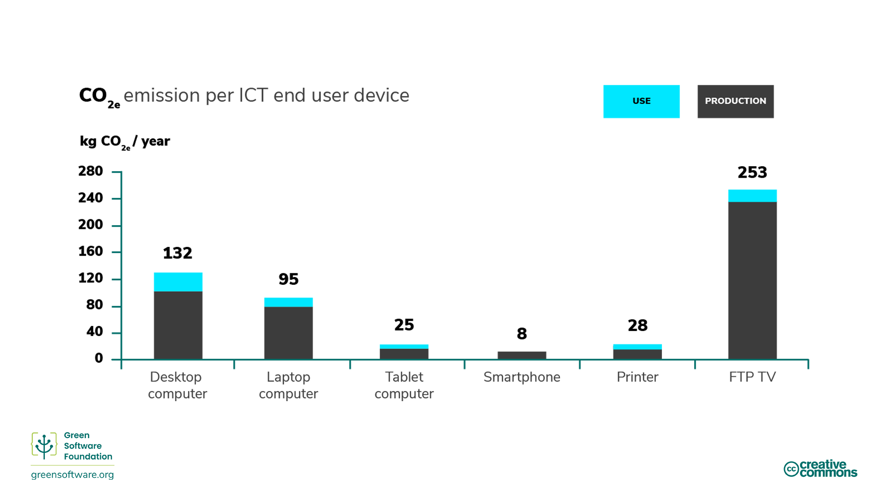
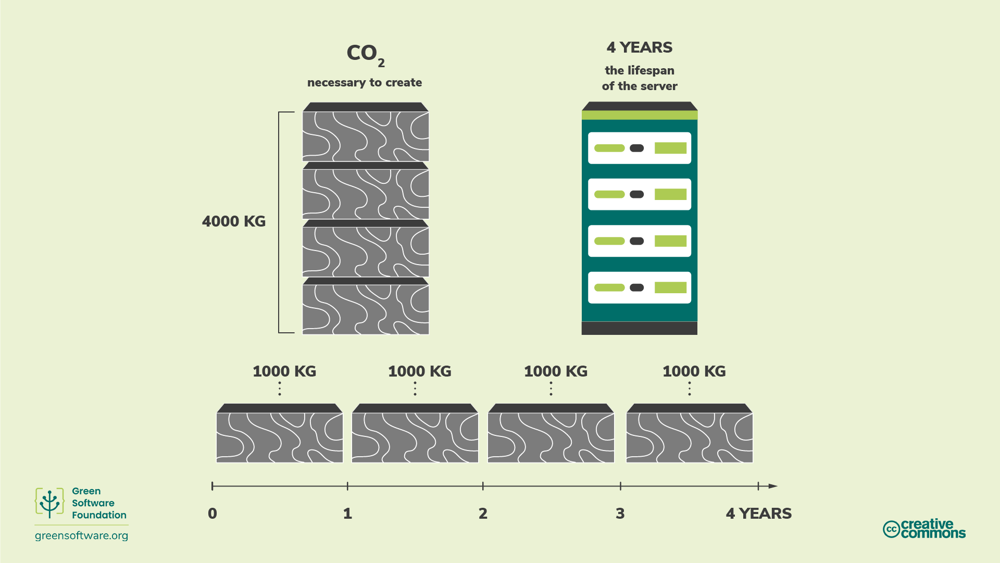

# Hardware EfficiencyGreenHPC

# Introduction

Hardware that makes up HPC systems is an important element\.

For HPC systems located in regions with low carbon intensity for electricity generation\, hardware could be the dominant component of associated emissions\.

This section will cover embodied carbon\, and the measures you can take to reduce the impact of creation\, destruction\, and running this hardware\.

# Embodied carbon

Embodied \(or embedded\) carbon is the amount of carbon emissions from the creation and disposal of a device\.

The device you are using right now to participate in this workshop has carbon production attached to its manufacturing\, and disposing of it at the end of its life may release more\.

When calculating the total carbon emissions for HPC services\, both the emissions from running the system as well as the embodied carbon of the hardware must be accounted for\.

Embodied carbon varies significantly between different hardware\!

By thinking in terms of embodied carbon\, any device is responsible for the release of carbon over its lifetime\, even if it isn’t consuming electricity\.

# Amortisation

Amortisation is the practice of spreading the cost of something over its useful life\.

For example\, suppose it took 4000 kgCO2e to build an HPC system\, and we expect it to last 4 years\. We can amortise this to say the HPC system emits 1000 kgCO2e/year\.

Typically\, we amortise the embodied emissions over the total amount of  __resource__  available on the HPC system over its lifetime; if the resource use is measured in GPUh\, then the emissions rate would be in kgCO2e/GPUh for the total GPUh available on the service over its lifetime\.

# How to improve hardware efficiency

* From the embodied carbon\, by the time a HPC system is installed it has already emitted a good deal of carbon\. Computers also have limited lifespan\, so hardware consumption is a proxy for carbon\.
* There are two main approaches to improving hardware carbon efficiency:
  * __Extending the lifespan __ – reduces the carbon emission rate per unit of resource due to amortisation
  * __Increasing the utilisation and performance__  – getting more useful work out of the hardware per unit of resource

# Extending the lifespan of hardware

From the previous slide\, if we can add just one more year to the lifespan of the HPC system\, then the amortised carbon emission rates from 1000 kgCO2e/year to 800 kgCO2e/year\.

HPC systems have historically had lifetimes of around 5\-7 years\, when they are replaced by newer systems that provide improved performance and functionality and are typically more energy efficient\.

Extending the lifetime of HPC systems for longer periods may lead to improved carbon efficiency\, outweighing the energy efficiency of new systems\.

# Increasing utilisation and performance

As well as increasing the lifespan\, we can also work to make sure we get the most out of the HPC hardware while we have it \- at a system level this means maximising service usage\.

100% utilisation is better than 20% due to embodied carbon\, and even idle components consume some electricity\.

For users\, improving carbon efficiency with respect to embodied carbon corresponds to increasing performance \(more output per unit of time\)\. Typically though\, this may lead to higher power draw and higher electricity use which increases the emissions from the use of electricity…

* We need to know the balance between embodied emissions and emissions from electricity use to make useful choices about improving efficiency\.
* There are three potential scenarios:
  * __Embodied carbon dominates__  – run as high performance as possible irrespective of electricity use
  * __Embodied carbon and carbon from electricity use are evenly balanced__  – you need to find a balance of performance and energy efficiency
  * __Carbon from electricity use dominates__  – run in as energy efficient a manner as possible

