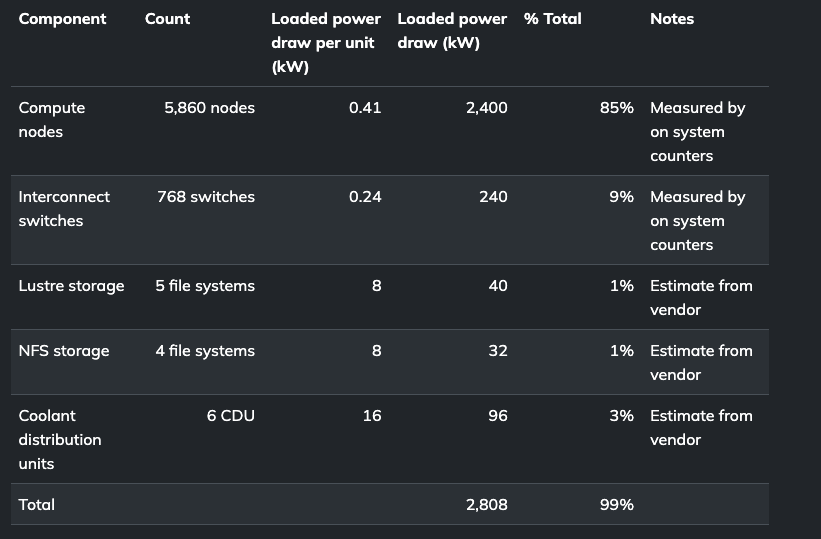
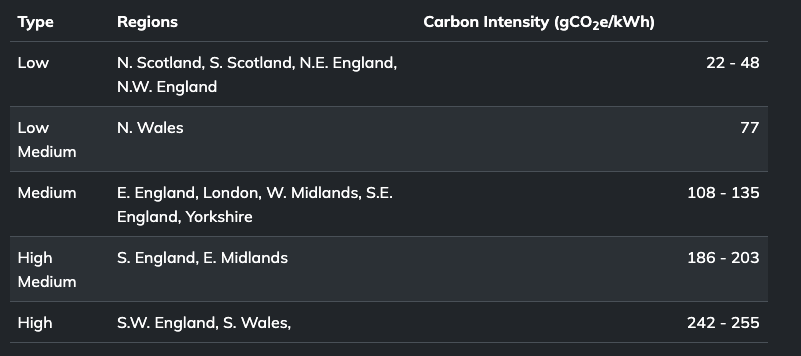
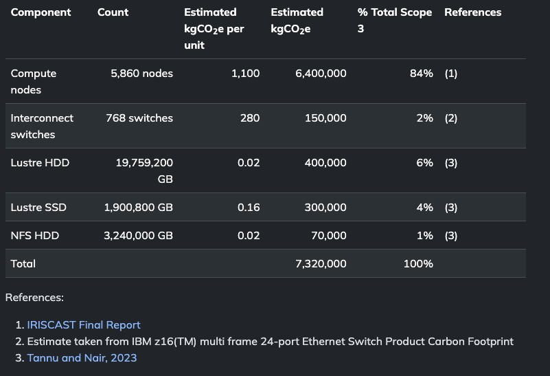

30th January 2025

# MeasurementGreenHPC

# Introduction

The Greenhouse Gas \(GHG\) protocol is the most commonly\-used method for organisations to measure their total carbon emissions\.

Understanding GHG scopes and how to measure your software against industry standards will help you see to what extent you are reducing carbon emissions and how that fits with wider activities to reduce emissions\.

The Software Carbon Intensity \(SCI\) specification complements the GHG protocol\.

GHG is a more generic measurement suitable for many organisations\, while SCI is specifically for measuring a rate of software emissions and designed to incentivise the elimination of those emissions\.

# The GHG protocol

The Greenhouse Gas protocol is the most widely used and internationally recognised greenhouse gas accounting standard\.

92% of Fortune 500 companies use the GHG protocol when calculating and disclosing their carbon emissions\.

Using the GHG protocol allows us to compare our emissions from use of HPC systems to other sources of emissions in a quantitative way\.

* The GHG protocol divides emissions into three scopes:
  * __Scope 1: __ direct emissions from operations owned or controlled by the reporting organisation\, such as on\-site fuel combustion or fleet vehicles\.
  * __Scope 2:__  indirect emissions related to emission generation of purchased energy\, such as heat and electricity\.
  * __Scope 3:__  other indirect emissions from all of the other activities you are engaged in\. Scope 3 emissions are typically split into two further categories\.
    * __Upstream scope 3: __ includes all emissions from an organization’s supply chain\, e\.g\. emissions from manufacturing and shipping a product\.
    * __Downstream scope 3: __ emissions resulting from the use of a product\, e\.g\. the electricity customers may consume when using your product or waste output from the product\.

* Scope 3\, sometimes referred to as value chain emissions\, is often the most significant source of emissions\, and the most complex to calculate\.
* These encompass the full range of activities needed to create a product or a service\, from conception to distribution\.
* In the example of a laptop:
  * Every raw material used in its production emits carbon when being extracted and processed \(part of upstream scope 3 emissions\)\.
  * Emissions from the use of the laptop meaning emissions from the energy used to power the laptop after it has been sold to a customer \(part of downstream scope 3 emissions\)\.
* Through this approach it is possible to sum up all of the GHG emissions from every organization and person in the world and reach a global total\.

# Exercise: What scope for HPC emissions?

Throughout this lesson\, we have spoken about emissions from two different sources associated with our use of HPC: emissions from the electricity used to run our models/simulations on HPC systems\, and embodied emissions from the HPC system hardware\.

Given the definitions of scope 1\-3 emissions given above\, which scope\(s\) do you think these two different sources of HPC system use emissions fall into?

# Exercise solution: What scope for HPC emissions?

Emissions from the electricity used would be classified as scope 2 emissions\.

Embodied emissions from HPC system hardware would be classified as upstream scope 3 emissions\.

# HPC electricity

Whether the emissions from electricity use on HPC systems are downstream scope 3 or scope 2 really depends on who is computing the emissions\, and for what purpose\.

From the point of view of the hardware vendor who sells and manufactures the HPC system\, the electricity use falls into downstream scope 3 emissions\.

For the operators and users of the HPC system\, the electricity use would be classified as scope 2 emissions\.

As we are approaching this subject as buyers\, operators\, and users of HPC systems\, we will always classify the emissions from our electricity use on HPC systems as scope 2\.

# How to calculate your HPC emissions

It can be tempting to only include the use of HPC that produced useful output in our emissions calculations\,  __this should be avoided\.__

The true amount of emissions includes  __all__  of our HPC system use to get us to the results we use\, and so failed jobs \(due to errors\) or calculations that did not produce useful output must be included\.

On the positive side\, one of the ways we can reduce our emissions from use of HPC systems is to be more careful and eliminate emissions arising from these types of non\-productive jobs\.

# How to calculate your HPC emissions – 1. Gather energy use

Many HPC systems now provide energy use data for jobs run on the system\.

If this is the case\, you can use these as the starting point for calculating your energy use of the HPC system\.

If this is not available you may need to estimate the energy use of the resources used from component power draw\.

Even if energy use is available\, this may only cover compute nodes \(or just processors on compute nodes\) so you typically have to do some estimation of power draw of other components\.

If you’re very lucky\, the HPC system staff will have done this calculation for you: this has been done for the UK National Supercomputing Service\, ARCHER2\.

We will cover two different ways to estimate the power draw of the HPC system\.

The methodologies outlined all assume the compute nodes are homogeneous\.

If this is not the case \(such as the case where some nodes have GPUs and others do not\)\, you should try to treat each homogeneous partition as its own smaller HPC system to help calculate energy use\.

First method \(a\) – use the total power draw of the system

This is one of the simplest ways to estimate the energy use\.

Use the total power draw of the HPC system and divide it by the number of components to get a mean power draw per component that can be used to estimate energy use\.

For example\, if the total power draw is 250 kW\, and there are 512 GPUs then the mean power draw per GPU is 250/512 = 0\.488 kW/GPU\.

Therefore\, the energy used for 12 hours use of 2 GPUs is estimated by 12 hours \* 2 GPUs \* 0\.488 kW/GPU = 11\.7 kWh\.

You should use the component that you measure resource use in to compute the mean power draw: if your usage is in GPUh then compute per GPU\, if your usage is in nodeh\, compute power draw per node\.

The second method \(b\) – using per\-component power draws

This approach requires more detailed information being available on the power draw of different component through measurement or from the vendors of the components\.

If you get your energy use from counters on the compute nodes\, as is sometimes possible on HPC systems\, then this approach allows you to estimate additional energy overheads that need to be added on in addition to measured power draw\.

The next slide illustrates this approach through estimates for the ARCHER2 HPC system\.

In this case we have a mix of data measured on the system \(power draw of the compute nodes and power draw of the interconnect switches\)\, and estimates from the vendor \(storage systems and CDU\)\.

The total power draw is estimated at 2808 kW; there are 5860 compute nodes and the unit of resource is nodeh so we can calculate the mean per\-node power draw \(including all of the components in the table\) in the same way as method \(a\)\.

This gives 2808 / 5860 = 0\.480 kW/node\, and then we can use this to compute energy consumption based on number of nodeh we use\.

However on ARCHER2 we also have the total compute node energy use available per job to users from the Slurm scheduler\. The table shows compute nodes contribute around 85% of the total power draw of ARCHER2\, so an alternative method to compute is to use the measurement from the scheduler and add an additional 15% to cover the energy from other components\.

In fact\, this is the methodology used for computing per\-job energy use on ARCHER2

As well as the energy used by the system itself\, there is also energy used by the plant that supplies heating and cooling to the HPC system\.

Different data centres have different overheads and this is given by PUE \(Power Use Efficiency\) from earlier in the lesson\. A PUE of 1\.25 indicates that an additional 25% energy use is added on top of the system energy use to account for the plant\.

The PUE will vary with outside weather conditions\. For the ARCHER2 example\, PUE is typically less than 10% so as a conservative estimate they add an additional 10% energy use to the total to account for plant overheads\.

* For the ARCHER2 example\, the process for computing your total energy user becomes:
  * Measure total compute node energy use from all jobs run via node counters
  * Add 15% extra energy to cover energy use from other components
  * Add another 10% energy use on top of this total so far to cover plant overheads

# How to calculate your HPC emissions – 2. Determine local carbon intensity

Once you have your energy use\, then you need to convert this to emissions using the carbon intensity for the electricity supply for the HPC system\.

In most cases\, HPC systems are powered by the energy grid and many energy grids provide details on the carbon intensity as a function of time\.

For the UK\, the carbon intensity is dependent on location and time\. You can access the values through different web services; a commonly used one is the Carbon Intensity API\.

Carbon intensity is reported every 30 minutes for every region\. To estimate your emissions can either use the fine\-grained intensity matched to the runtimes of your HPC system use\, or use an aggregate value over a longer period\.

The aggregate value is a simpler choice for a first estimate\.

The table below shows the approximate average carbon intensities for the different regions of the UK national grid for 2024 ordered from lowest to highest\.

# How to calculate your HPC emissions – 3. Determine embodied emissions

We are only considering upstream scope 3 emissions; the emissions from electricity use are captured in the scope 2 emissions estimates\.

Calculating the embodied emissions can be more difficult than operational emissions due to problems getting information on embodied emissions associated with HPC system hardware\.

You may be lucky\, and the HPC system you are using could already provide estimates of the embodied emissions that you can then use\!

* If you do need to estimate this yourself\, the major contributors to embodied emissions are likely to be:
  * Compute nodes
  * Interconnect switches
  * Storage
* Bear in mind each HPC system is different so other components may need to be taken into account\.
* You should start by finding out which components make up the majority of the system\, by number of items\.
* Additionally\, complex components \(such as nodes\, storage\, switches\) are likely to have higher embodied emissions than simpler components \(such as pumps\, fans\, cables\)\.

As an example\, here is how the embodied emissions for ARCHER2 have been estimated\.

Note that there is a large amount of uncertainty for scope 3 emissions due to lack of high quality embodied emissions data\.

The number used for the compute node emissions is at the high end of estimated values for a CPU\-only compute node; the actual value could be up to 15% lower\.

If the lower value is used it reduces the overall estimated embodied emissions but does not significantly change the fraction of emissions attributed to the compute nodes\.

We have not included embodied emissions associated with the data centre buildings and plant in this analysis\.

While the total embodied emissions can be high\, their long lifespan means that their contribution during the lifetime of the HPC system is generally much less significant than that of the HPC system hardware itself\.

# How to calculate your HPC emissions – 4. Compute your total HPC emissions

Rather than computing total energy use\, and then using an aggregate value for the carbon intensity\, it may make more sense to compute the operational emissions \(carbon emissions from the electricity required for your HPC use\) on a per\-job basis using the carbon intensity value at the job time\.

This is the approach used in the tools available on ARCHER2 for estimating emissions\.

# Exercise: Computing total emissions from HPC system use

* You are using \(or running\) a GPU\-based HPC service and a particular project has used the following amounts of resource over 3 months:
  * 1100 GPUh
  * 3\,542\,000 kWh
* The total embodied emissions for the service are 6\,500\,000 kgCO2e\, the service lifetime is 7 years\, and there are 1000 compute nodes each with 8 GPU\. The service is hosted in a location with a carbon intensity of 40 gCO2e/kWh\.
  * Compute the scope 2 emissions for the project use\.
  * Compute the scope 3 emissions rate in kgCO2e/GPUh
  * Compute the scope 3 emissions for the project use
  * Compute the total emissions for the project use
  * Do scope 2 or scope 3 emissions dominate or are they evenly matched?

The scope 3 emissions for the project use is the number of GPUh used multiplied by the scope 3 emissions per GPUh: 1100 GPUh x 0\.013 kgCO2e/GPUh = 14\.3 kgCO2e\.

Total emissions are scope 2 \+ scope 3 emissions: 141\,700 kgCO2e \+ 14\.3 kgCO2e = 141\,714 kgCO2e\.

Scope 2 emissions \(from electricity use\) heavily dominate the emissions in this example\.

