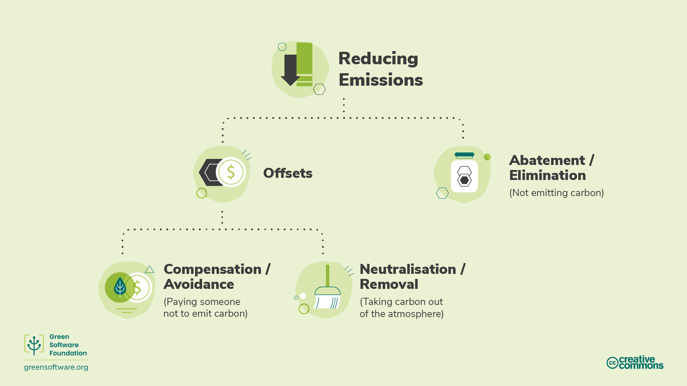

# Carbon Reduction MethodologiesGreenHPC

# Introduction

In recent years\, many economic actors have sought to reach different climate goals by making various commitments to reducing carbon emissions\.

The terms “net zero”\, “carbon neutral”\, “carbon negative”\, and “climate neutral” have been used interchangeably with the primary objective to remove\, reduce\, and prevent carbon emissions\.

As interest in these targets grows\, it is essential to have a common understanding of what they mean and how to achieve them through the strategies and measurement procedures we have learnt\.

# Carbon reduction methodologies

There are many ways to reduce emissions but it’s important to understand the exact mechanism of the reduction when thinking about reduction targets\.

# Abatement / Carbon Elimination

The Science Based Targets Initiative refers to a mechanism called abatement\, which means eliminating sources of CO2 emissions associated with an organisation’s operations and value chain so that they do not enter the atmosphere\.

The value chain describes the full range of activities needed to create a product or service\, from conception to distribution\.

Abatement is not enough on its own; there will always be some emissions that cannot be eliminated due to technological or economic constraints\, but it must from the core of every emissions reduction strategy\.

To balance these residual emissions\, we need to look at other mechanisms such as offsets\, compensations\, or neutralisations\.

# Exercise: Strategies for abatement

Abatement is the critical component of carbon emissions reduction strategies\. Pick one of the questions below \(whichever is most relevant for your role\) and write down some answers\.

__Can you think of actions that individual users/researchers could take to implement abatement in their use of HPC systems?__

__Can you think of actions that a service operator could take to implement abatement in the operation of HPC systems?__

__Can you think of actions that an organisation procuring HPC systems could take to implement abatement when buying HPC systems?__

# Exercise solution: Strategies for abatement

* Individual users:
  * Run fewer jobs; reduce wasted resources by having fewer job failures; run on systems that minimise emissions \(spatial shifting\); run when emissions from electricity are lower \(temporal shifting\)\.
* Service operators:
  * Build scheduler policies to eliminate emissions; provide tools and information that allow users to quantify their emissions and measure reductions; provide training on carbon emissions and abatement strategies\.
* Service procurement:
  * Purchase the minimum amount of hardware possible for the service; build scoring on amount of embodied and operational emissions into the procurement process; site HPC systems at locations that have low carbon intensities; run services for as long as possible\.

# Offsets

Offsets are direct investments in emission\-reduction projects through the purchase of carbon credits on the voluntary carbon market \(VCM\)\.

The VCM is a decentralised market where private actors voluntarily buy and sell carbon credits that represent certified removals or reductions of greenhouse gases from the atmosphere\.

To offset emissions you need to purchase the equivalent volume of carbon credits to compensate for those emitted\, where one carbon credit corresponds to one tonne of CO2 absorbed or reduced\.

Various positive benefits can stem from these projects from ecosystem protection to empowering local communities\.

To ensure these programs are implemented correctly\, there are global standards that they must meet such as Verified Carbon Standard \(VCS\) and Gold Standard \(GS\)\.

# HPC-CI and Offsets

There are some limitations to carbon offsets and that is why they are not considered in an HPC\-CI metric\.

Imagine two projects\, both running on an HPC service that is 100% carbon offset and matched 100% by renewable energy\. Project A has invested significant time and resources into making sure it is using resources efficiently\, whereas project B uses resources very inefficiently\. For HPC\-CI to be a useful metric\, project A needs to score better than project B\.

If HPC\-CI considered offsets\, both projects would score 0 due to the service they are using\. This does not tell us about how efficiently they are using resources\.

Although project B is emitting more carbon molecules into the atmosphere per unit of output\, since its score is 0 and the lowest score is 0\, why would it make further investments into improving its carbon efficiency?

HPC services and users need to have plans for how to both eliminate as well as neutralise emissions and the HPC\-CI helps to drive the elimination of emissions due to use of HPC systems\.

# Compensating / Carbon Avoidance

* Compensations are actions that organisations or individuals can take to help society avoid or reduce emissions\. This is essentially investing in other organisations’ abatement projects\.
* This includes actions such as:
  * __Conservation __ – credits are created based on carbon not released through protecting old trees
  * __Community projects__  – these projects help communities worldwide\, mainly undeveloped ones\, by introducing sustainable living methods
  * __Waste to energy__  – these projects capture methane or landfill gas in smaller villages\, human\, or agricultural waste\, and convert it into electricity

# Neutralising / Carbon Removal

* Neutralisations are actions that organisations or individuals take to remove carbon from the atmosphere\. Neutralisations refer to the removal and permanent storage of atmospheric carbon to counterbalance the effect of releasing CO2 into the atmosphere\.
* This includes actions such as:
  * __Enhancing natural carbon sinks__  that remove CO2 from the atmosphere\. For example\, forest restoration since photosynthesis removes CO2 naturally\. Forest expansion comes with challenges as it is essential not to impact the dynamics of farmland and food supply elsewhere\. Modern farming methods can also prolong the length of time that carbon remains stored in soil\.
  * __Direct air capture__  is the process of capturing CO2 from the air and storing it permanently\, either underground or in long\-lived products like concrete\.

* The effectiveness of these methods is typically measured based on whether they can deliver carbon removal at the scale and speed needed\.
* In carbon removal projects\, durability is a critical consideration; the durability of a project describes how long the carbon dioxide will be kept from the atmosphere\.
* Short\-term durability is up to 100 years\, medium\-term is 100 to 1\,000 years\, and long\-term is more than 1\,000 years\.
  * Solutions that rely on Earth’s natural carbon cycle have short\-term durability measured in decades\, for example forestry projects have a durability of 40 to 100 years
  * Engineered solutions such as direct air capture often have long\-term durability measured in millennia\, for example direct air capture has a durability of 10\,000 years

Long\-term projects are typically orders of magnitude more expensive than short\-term projects\.

Once emitted\, carbon remains in the atmosphere for 5\,000 years\. To be considered net zero\, carbon that has been emitted needs to be permanently removed\.

A short\-term carbon removal project will only remove carbon for 100 years \(or less\)\, after which it is back in the atmosphere\, warming up our planet\.

This is one of the reasons abatement is preferred to neutralisation; never releasing carbon is better than releasing carbon and trying to keep it out of the atmosphere for 5\,000 years\.

