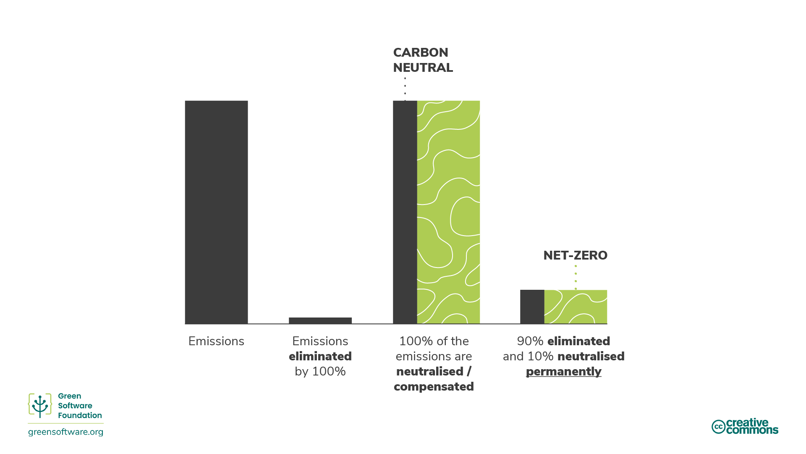

# Climate CommitmentsGreenHPC

# Climate Commitments

There are many different emissions reduction strategies that an organisation can commit to\, from carbon neutral to net zero\. Understanding the different meanings and implications of each\, and knowing which are implemented by the facilities you use can help you understand how your use of HPC fits within wider climate goals\.

# Carbon Neutral

To achieve carbon neutrality an organisation must measure its emissions\, then match the total to its emissions offsets through carbon reduction projects\. This can include carbon removal projects \(neutralisations\) and carbon avoidance projects \(compensations\)\.

Carbon neutrality is defined by an internationally recognised standard: PAS 2060\.

Although this recommends an organisation sets abatement targets\, it does not demand they reduce their emissions\. To be considered carbon neutral\, an organisation can just measure and offset without investing resources in eliminating their carbon emissions\.

To be carbon neutral\, you must cover direct emissions \(scopes 1 and 2\)\.

The general expectation is that organisations measure and offset their scopes 1 and 2\, and business travel from scope 3\. However\, there is no specific requirement to include that\.

Carbon neutral is a significant first step for any organisation since it encourages measurement\.

However\, there are not enough carbon offsets in the world to offset the emissions of all the organisations\.

Any strategy that does not include abatement will not scale or help the world achieve the 1\.5ºC set by the Paris Climate Agreement\. This is where net zero comes into play\.

# Net Zero

Net zero means reducing emissions according to the latest climate science and balancing remaining residual emissions through carbon removals \(neutralisations\)\.

Net zero\, by definition\, requires emissions reductions in line with a 1\.5ºC pathway\. All organisations must do this to achieve net zero global emissions by 2050\.

The critical differentiator between net zero and carbon neutral is that net zero focusses on abatement rather than neutralisations and compensations\. A net zero target aims to eliminate emissions and only to use offsetting for the residual emissions that you cannot eliminate\.

The standard for net zero is being developed by the Science Based Targets initiative \(SBTi\)\.

They calculate that there is a 66% probability of limiting global warming to 1\.5ºC if we reach a level of abatement of about 90% of all GHG emissions by mid\-century\.

So\, to meet a net zero target\, an organisation needs to eliminate 90% of its emissions by 2050\.

The remaining emissions can only be offset using neutralisations and permanent carbon removals\.

A net zero strategy would mean that the actual amount of carbon in the atmosphere remains constant\.

Also\, to be a net zero target you must cover direct and indirect\, i\.e\. supply chain emissions \(scopes 1\, 2\, and 3\)\. This is significant since scope 3 often represents the majority of emissions\.

For HPC facilities\, part of these strategies include educating and putting policies and approaches in place to support users to understand and take action to reduce their emissions and maximise the carbon efficiency of their HPC use\.

